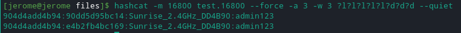

# Laboratoire - attaque PMKID 

> Gaëtan Daubresse et Jérôme Arn

## 2. Cracker la Passphrase utilisant l'attaque PMKID

Voici notre script en action.

## 3. Attaque hashcat

Nous avons fait de deux manières différentes pour trouver avec hashcat. Pour la première, nous avons supposé que nous connaissions le pattern du mot de passe (5 lettres minuscule suivi de 3 chiffres). 

Dans l'autre cas nous avons fait une attaque par dictionnaire. 

